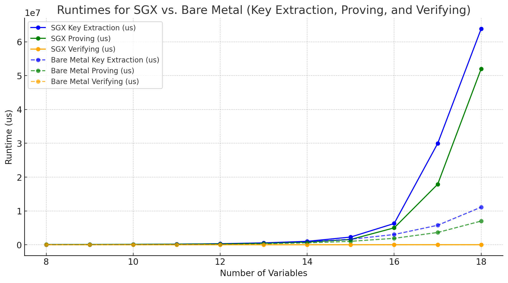

I ported [hyperplonk](https://github.com/EspressoSystems/hyperplonk) (dc194f83ef5cae523b869f7256f314bdbeb2a42c) to SGX using Rust SGX SDK v2.

Some preliminary performance comparision. Ceveat: code is not optimized for TEE. Untrusted threads are used for benchmark. The panelty is up to 5x within the range of tested parameters.



## In SGX

```
start benchmark with #8 threads
key extraction for 8 variables: 34008 us
proving for 8 variables: 65781 us
verifying for 8 variables: 10809 us
key extraction for 9 variables: 59095 us
proving for 9 variables: 92225 us
verifying for 9 variables: 11738 us
key extraction for 10 variables: 93310 us
proving for 10 variables: 121446 us
verifying for 10 variables: 12909 us
key extraction for 11 variables: 167493 us
proving for 11 variables: 184560 us
verifying for 11 variables: 12283 us
key extraction for 12 variables: 313086 us
proving for 12 variables: 279089 us
verifying for 12 variables: 14946 us
key extraction for 13 variables: 558040 us
proving for 13 variables: 455471 us
verifying for 13 variables: 12906 us
key extraction for 14 variables: 1014790 us
proving for 14 variables: 805950 us
verifying for 14 variables: 12954 us
key extraction for 15 variables: 2282160 us
proving for 15 variables: 1566831 us
verifying for 15 variables: 13551 us
key extraction for 16 variables: 6291214 us
proving for 16 variables: 5002293 us
verifying for 16 variables: 13907 us
key extraction for 17 variables: 29948787 us
proving for 17 variables: 17890216 us
verifying for 17 variables: 15706 us
key extraction for 18 variables: 63837721 us
proving for 18 variables: 52023151 us
verifying for 18 variables: 15243 us
[out of memory]
```

## Out of SGX (on the same machine)

```
start benchmark with #8 threads
key extraction for 8 variables: 35425 us
proving for 8 variables: 28515 us
verifying for 8 variables: 8322 us
key extraction for 9 variables: 48469 us
proving for 9 variables: 41330 us
verifying for 9 variables: 9166 us
key extraction for 10 variables: 80116 us
proving for 10 variables: 62790 us
verifying for 10 variables: 9488 us
key extraction for 11 variables: 144847 us
proving for 11 variables: 101975 us
verifying for 11 variables: 9351 us
key extraction for 12 variables: 260707 us
proving for 12 variables: 175753 us
verifying for 12 variables: 10016 us
key extraction for 13 variables: 489831 us
proving for 13 variables: 308309 us
verifying for 13 variables: 10298 us
key extraction for 14 variables: 872983 us
proving for 14 variables: 557014 us
verifying for 14 variables: 10515 us
key extraction for 15 variables: 1623094 us
proving for 15 variables: 1023279 us
verifying for 15 variables: 10088 us
key extraction for 16 variables: 3035554 us
proving for 16 variables: 1906113 us
verifying for 16 variables: 10890 us
key extraction for 17 variables: 5766622 us
proving for 17 variables: 3636429 us
verifying for 17 variables: 11375 us
key extraction for 18 variables: 11119108 us
proving for 18 variables: 7011321 us
verifying for 18 variables: 11570 us
key extraction for 19 variables: 20790819 us
proving for 19 variables: 13465287 us
verifying for 19 variables: 11801 us
key extraction for 20 variables: 40130832 us
proving for 20 variables: 27350878 us
verifying for 20 variables: 11972 us
```